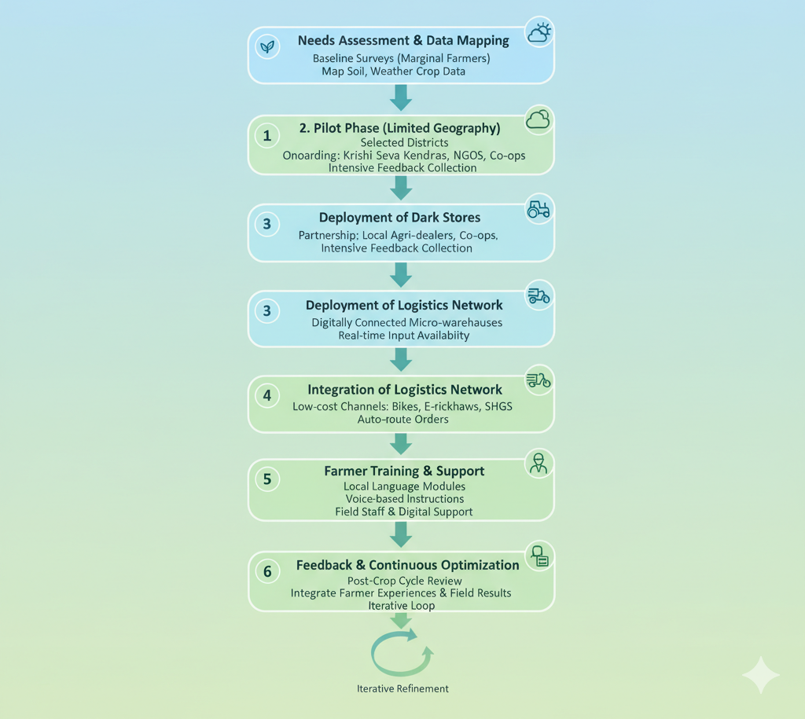
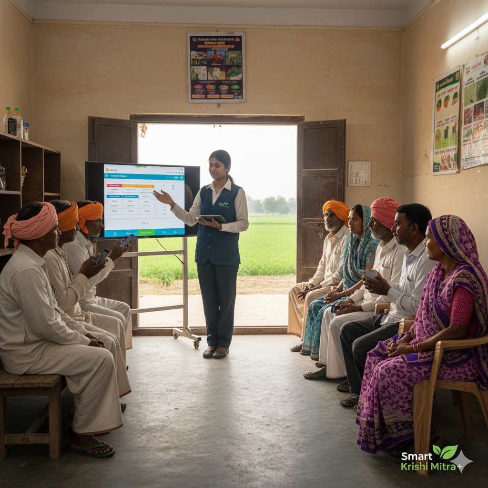

# Smart India Hackathon Workshop
# Date:22.9.2025
## Register Number:25009952
## Name:Subashini
## Problem Title
SIH 25010: Smart Crop Advisory System for Small and Marginal Farmers
## Problem Description
A majority of small and marginal farmers in India rely on traditional knowledge, local shopkeepers, or guesswork for crop selection, pest control, and fertilizer use. They lack access to personalized, real-time advisory services that account for soil type, weather conditions, and crop history. This often leads to poor yield, excessive input costs, and environmental degradation due to overuse of chemicals. Language barriers, low digital literacy, and absence of localized tools further limit their access to modern agri-tech resources.

Impact / Why this problem needs to be solved

Helping small farmers make informed decisions can significantly increase productivity, reduce costs, and improve livelihoods. It also contributes to sustainable farming practices, food security, and environmental conservation. A smart advisory solution can empower farmers with scientific insights in their native language and reduce dependency on unreliable third-party advice.

Expected Outcomes

• A multilingual, AI-based mobile app or chatbot that provides real-time, location-specific crop advisory.
• Soil health recommendations and fertilizer guidance.
• Weather-based alerts and predictive insights.
• Pest/disease detection via image uploads.
• Market price tracking.
• Voice support for low-literate users.
• Feedback and usage data collection for continuous improvement.

Relevant Stakeholders / Beneficiaries

• Small and marginal farmers
• Agricultural extension officers
• Government agriculture departments
• NGOs and cooperatives
• Agri-tech startups

Supporting Data

• 86% of Indian farmers are small or marginal (NABARD Report, 2022).
• Studies show ICT-based advisories can increase crop yield by 20–30%.

## Problem Creater's Organization
Government of Punjab

## Theme
Agriculture, FoodTech & Rural Development

## Proposed Solution
<h3>Smart Krishi Mitra: AI-Driven Crop Advisory for Marginal Farmers</h3>
<ul><li>Smart Krishi Mitra+ is an AI-powered crop advisory and instant agri-commerce solution designed for India’s marginal farmers. It goes beyond giving crop suggestions — it connects advice with immediate action.

When the system recommends a crop variety, fertilizer, or pest-control measure, farmers can instantly order the exact input through the app (or even via voice call/SMS). Powered by a network of regional dark stores — small, hyper-local agri-warehouses strategically placed in rural clusters — the required seeds, fertilizers, bio-pesticides, or farming tools are delivered to the farmer’s doorstep within hours.

This integration ensures that knowledge doesn’t remain theoretical: the advisory is directly linked with availability and access. No need to travel miles to a market, no delays in implementation. Smart Krishi Mitra+ turns insights into instant, practical solutions, making agriculture more responsive, efficient, and farmer-friendly.

By combining AI-driven personalized crop guidance with dark stores and instant delivery logistics, the platform not only boosts yield and reduces risk but also removes supply bottlenecks, empowering marginal farmers with the speed and convenience of modern commerce adapted to rural realities.</li>
<li>How Smart Krishi Mitra+ Addresses the Problem

Marginal farmers in India often face three core challenges: lack of timely information, lack of access to affordable agricultural inputs, and delays in implementing advice due to poor supply chains. Smart Krishi Mitra+ directly bridges these gaps.

First, the platform provides real-time, personalized crop advisory using weather data, soil conditions, and local cropping history. This ensures farmers receive precise and actionable guidance, rather than generic suggestions.

Second, the integration of regional dark stores guarantees that the recommended seeds, fertilizers, or pest-control products are physically available nearby. By decentralizing storage into rural clusters, the supply chain becomes shorter and more reliable.

Third, the instant delivery mechanism ensures that once advice is given, the necessary inputs reach farmers quickly, preventing delays that could affect crop health or yield. This transforms advisory from a theoretical suggestion into an immediately applicable solution.

Together, these features create a cycle of trust and efficiency: farmers gain knowledge, gain access to the right resources, and can act without delay. This addresses the root causes of crop failures, low productivity, and income insecurity among marginal farmers.
</li>
<li>Innovation and uniqueness of the solution

Innovation and Uniqueness of Smart Krishi Mitra+
Smart Krishi Mitra+ is not just another crop advisory tool. Its innovation lies in fusing intelligent recommendations with instant action. Unlike traditional advisory platforms that stop at providing information, this solution ensures farmers can immediately implement advice through integrated supply and delivery mechanisms.

The uniqueness comes from three dimensions. First, the system leverages AI to deliver hyper-local, farmer-specific crop guidance in regional languages and through accessible channels such as SMS, voice calls, and WhatsApp, making it inclusive even for digitally less literate users.

Second, the solution introduces the concept of rural dark stores—mini agri-warehouses strategically located within villages or small clusters. These stores act as ready hubs for seeds, fertilizers, and farm inputs, ensuring availability within short distances.

Third, it integrates instant delivery logistics into the advisory cycle. When a farmer receives guidance, the exact recommended inputs can be ordered and delivered within hours, removing the common gap between advice and implementation.

By merging advisory intelligence with commerce and logistics, Smart Krishi Mitra+ creates an end-to-end ecosystem where knowledge, access, and action are seamlessly connected. This combination of AI-driven insight, rural dark store infrastructure, and instant supply makes the solution truly unique in the agricultural innovation landscape.
</li></ul>

## Technical Approach
<h3> Technical Approach – The Digital Backbone of Smart Krishi Mitra+</h3>
<ul><li>Technical Approach – The Digital Backbone of Smart Krishi Mitra+

The technical foundation of Smart Krishi Mitra+ blends advanced data intelligence with rural-ready infrastructure to deliver seamless advisory and instant action.

1. AI-Driven Advisory Engine
   A machine learning core processes satellite imagery, soil health data, historical weather trends, and local crop patterns. The advisory engine is trained on regional datasets to deliver precise, crop-specific recommendations tailored to the microclimate of each farmer’s field.

2. Multi-Channel Farmer Interface
   Farmers access the platform through mobile apps, WhatsApp, IVR-based voice calls, and SMS. This multi-channel design ensures inclusivity for marginal farmers who may not have smartphones or high literacy levels.

3. Rural Dark Store Network
   Dark stores, positioned strategically within villages, serve as last-mile fulfillment hubs for seeds, fertilizers, pesticides, and farming tools. These micro-warehouses are digitally integrated with the platform to update inventory in real time.

4. Instant Delivery Logistics Layer
   The system incorporates a lightweight logistics module connecting dark stores with local delivery partners (including e-rickshaws, bikes, or even community-led cooperatives). Orders triggered from the app or advisory are fulfilled within hours, creating a fast response loop.

5. Feedback and Learning Loop
   Farmers’ crop outcomes and feedback are continuously fed back into the system. This adaptive loop enables the AI models to refine future recommendations, ensuring increasing accuracy and contextual relevance over time.

Through this integrated architecture, Smart Krishi Mitra+ transforms fragmented agricultural advisory into a full-stack, tech-enabled ecosystem where decision-making and input access are inseparable.

</li>
<li>Methodology and process for implementation

The implementation of Smart Krishi Mitra+ follows a phased, structured, and adaptive process designed to balance innovation with rural feasibility.

1. Needs Assessment and Data Mapping
   The process begins with baseline surveys to capture the specific needs of marginal farmers across regions. Simultaneously, relevant datasets—soil health cards, weather data, and crop history—are mapped into the advisory engine.

2. Pilot Phase with Limited Geography
   Small-scale pilot programs are rolled out in selected districts. Farmers are onboarded through local Krishi Seva Kendras, NGOs, and cooperatives. Feedback is collected intensively to refine advisory accuracy, delivery models, and app usability
3.
    Deployment of Dark Stores
   Rural dark stores are established in partnership with local agri-dealers and cooperatives. These act as digitally connected micro-warehouses, ensuring real-time availability of inputs.

4. Integration of Logistics Network
   A local logistics ecosystem is formalized using low-cost delivery channels—bikes, e-rickshaws, and community self-help groups. Orders placed via the advisory platform are automatically routed to the nearest dark store for instant fulfillment.

5. Farmer Training and Support
   Training modules in local languages, voice-based instructions, and peer-to-peer learning groups are created to build trust and adoption among farmers. Field staff and digital support channels assist in bridging any technology gaps.

6. Feedback and Continuous Optimization
   After every crop cycle, farmer experiences and field results are integrated into the system. This iterative feedback loop sharpens advisory recommendations, optimizes delivery operations, and strengthens farmer satisfaction.

7. Scale-Up and Regional Customization
   Once stabilized, the solution scales across multiple districts and states. AI models are retrained with region-specific data, while dark store networks expand organically through local entrepreneurs.

This step-by-step methodology ensures that Smart Krishi Mitra+ not only delivers immediate impact but also builds a sustainable ecosystem that evolves with farmers’ changing needs.

 <b>
 
 

</b></li></ul>

## Feasibility and Viability
<h3>Feasibility and Viability</h3>
<ul><li>Feasibility Analysis

Smart Krishi Mitra+ is technically, operationally, and financially feasible. Technically, it leverages cloud-based AI, satellite data, and low-bandwidth communication channels, making it suitable for rural areas. Operationally, it uses existing agri-input shops as dark stores and local delivery networks, minimizing infrastructure costs. Financially, the platform can generate revenue through input sales, subscriptions, and partnerships, while remaining affordable for marginal farmers. Socially, it empowers farmers with timely advice and instant access to inputs, creating a sustainable and scalable model for rural agriculture.</li>
<li>Potential Challenges and Risks

Connectivity Issues: Limited internet or mobile network coverage in remote villages may affect real-time advisory and order placement.

Farmer Adoption: Resistance to new technology due to low digital literacy or distrust in AI recommendations.

Supply Chain Bottlenecks: Delays in stocking or delivering inputs from dark stores could reduce effectiveness.

Data Accuracy: Incomplete or outdated soil, weather, or crop data could lead to suboptimal recommendations.

Financial Sustainability: Maintaining low costs while scaling dark stores and delivery logistics may be challenging initially.</li>
<li>Strategies for Overcoming Challenges

Connectivity: Use SMS/voice-based advisory alongside the app.

Adoption: Conduct local training and demonstration sessions.

Supply Chain: Pre-stock inputs in regional dark stores and partner with local delivery networks.

Data Accuracy: Regularly update datasets from satellites, government sources, and farmer feedback.

Financial Sustainability: Leverage partnerships, subscriptions, and commissions to cover operational costs.</li></ul>

## Impact and Benefits
<h3>Impact and Benefits</h3>
<ul><li>Potential Impact on the Target Audience

Smart Krishi Mitra+ empowers marginal farmers by providing timely, personalized crop advice and instant access to inputs, improving yields, reducing crop failure risks, and increasing income. It also builds digital literacy, strengthens local supply chains, and fosters sustainable farming practices, creating a measurable positive effect on rural livelihoods.</li>
<li>Benefits of the Solution

Smart Krishi Mitra+ enhances social well-being by empowering farmers with knowledge and accessibility, boosts economic gains through higher yields and reduced input costs, and supports environmental sustainability by promoting data-driven, resource-efficient farming practices.
</li></ul>

## Research and References
<h3>Research and References</h3>
<ul><li>Mobile phone based agro-advisory system for agricultural challenges in rural india 
click here https://scholar.google.com/citations?view_op=view_citation&hl=en&user=bhSXOcsAAAAJ&citation_for_view=bhSXOcsAAAAJ:u5HHmVD_uO8C</li></ul>
